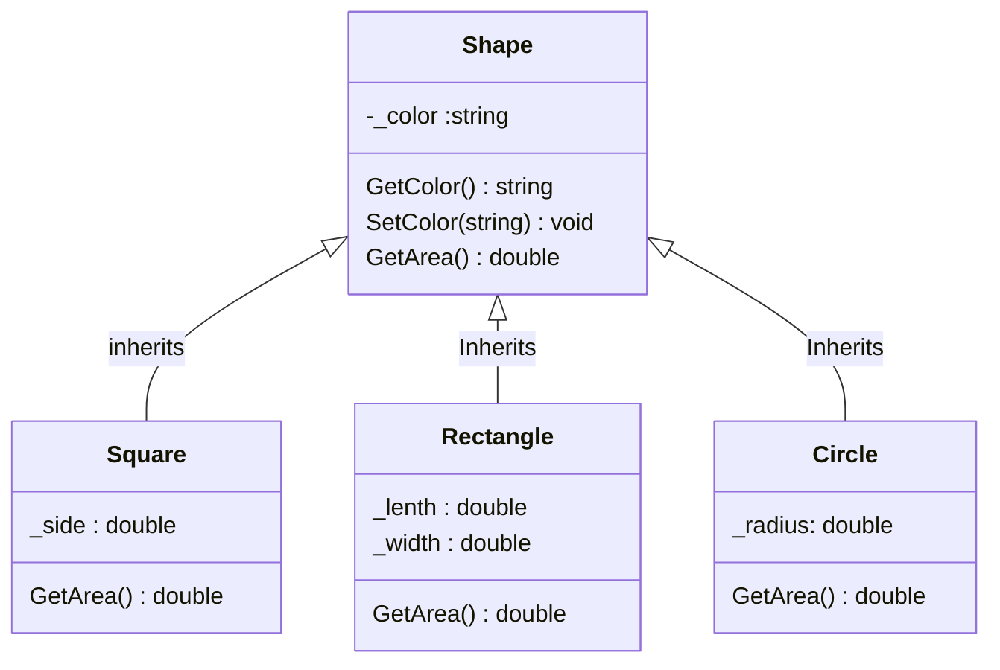

# Learing Ploymorphism

```mermaid
classDiagram
    class Shape{
        -_color :string

        GetColor() string
        SetColor(string) void

        GetArea() double
    }

    Shape <|-- Square: inherits

    class Square{
        _side : double
        GetArea() double
    }

    Shape <|-- Rectangle : Inherits

    class Rectangle{
        _lenth : double
        _width : double

        GetArea() double
    }
    Shape <|-- Circle : Inherits
    class Circle{
        _radius: double
        GetArea() double
    }


```
