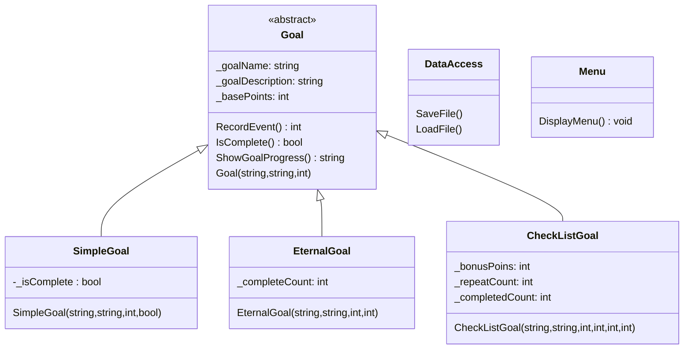

# Goal Tracker - Gamification 

## Polymorphism

```mermaid
classDiagram
    class Goal{
        <<abstract>>
        _goalName: string
        _goalDescription: string
        _basePoints: int

         RecordEvent() int
         IsComplete() bool
         ShowGoalProgress() string 
         Goal(string,string,int) 
    }

    Goal <|-- SimpleGoal

    class SimpleGoal{
        -_isComplete : bool
        SimpleGoal(string,string,int,bool)
    }

    Goal <|-- EternalGoal
    class EternalGoal{
        _completeCount: int
        EternalGoal(string,string,int,int)
    }

    Goal <|-- CheckListGoal
    class CheckListGoal{
        _bonusPoins: int
        _repeatCount: int
        _completedCount: int
        CheckListGoal(string,string,int,int,int,int)
    }

    class DataAccess{
        SaveFile() 
        LoadFile() 

    }

    class Menu{
        DisplayMenu() void
    }

```